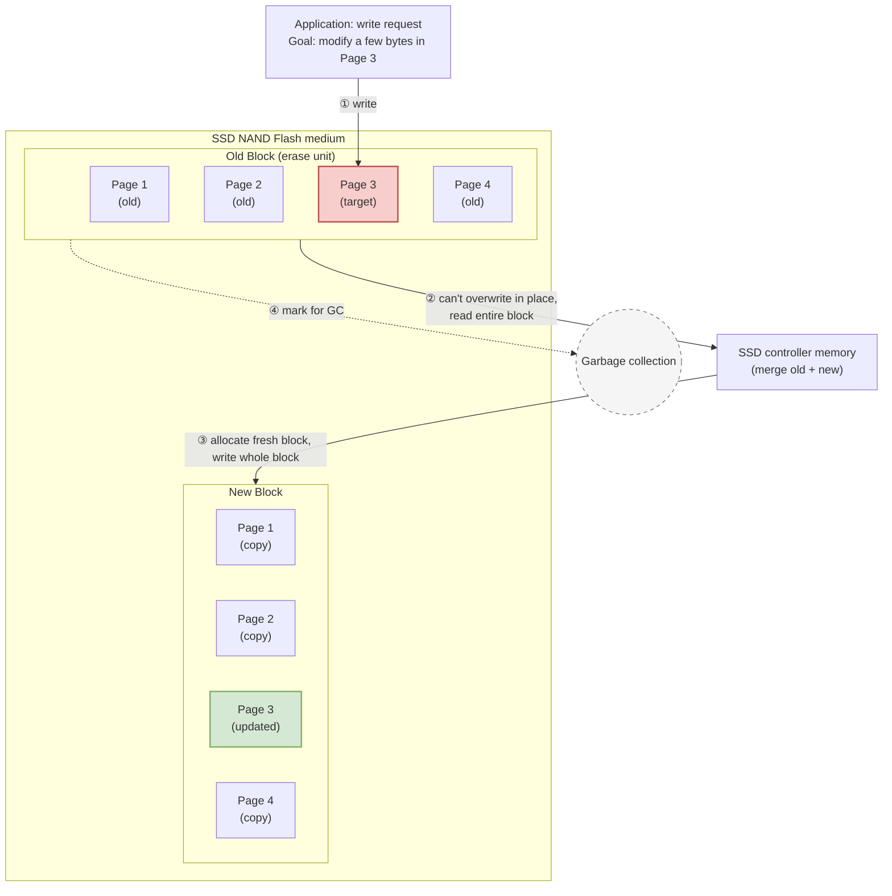
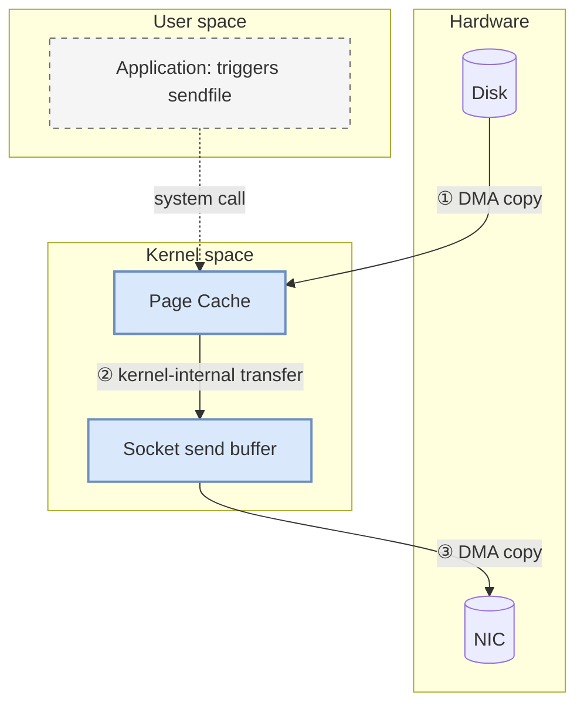
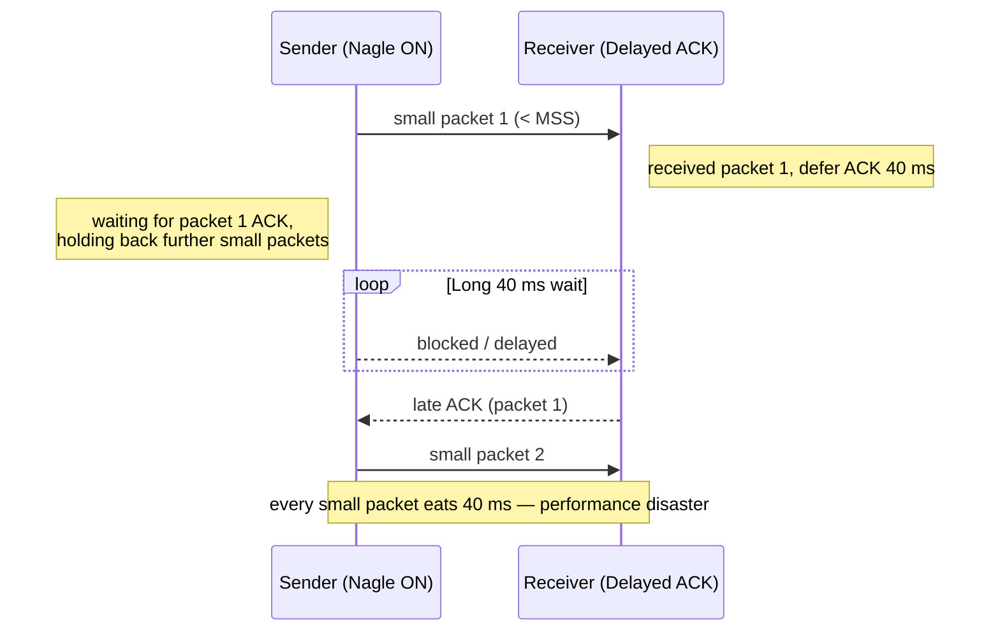
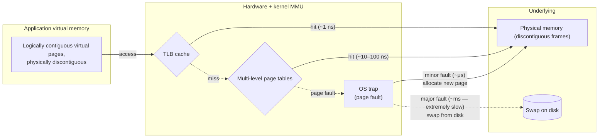
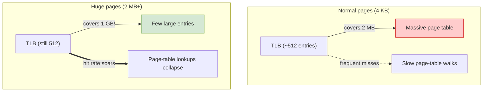
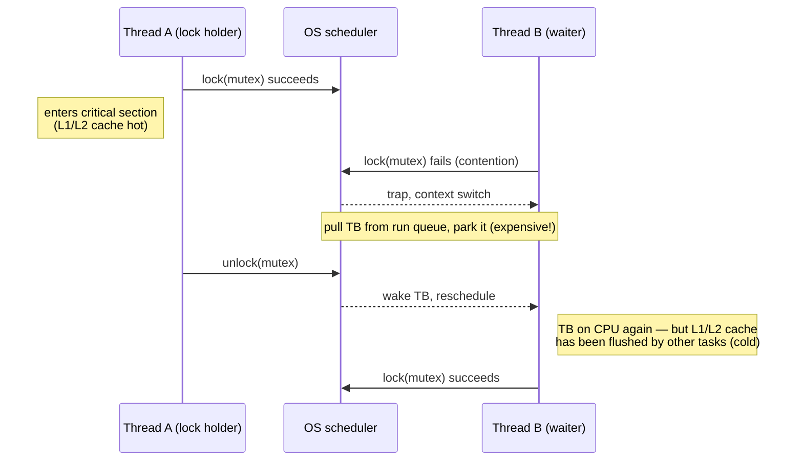
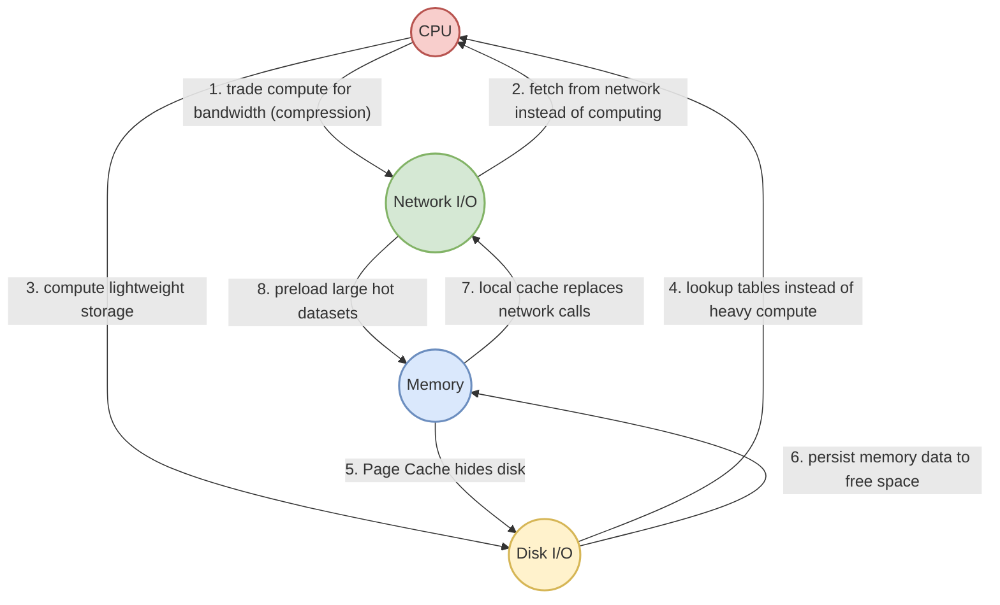

# Software Performance: I/O

In *Software Performance: CPU*, we walked through how to wring every clock cycle out of the CPU — multi-core, caches, branch prediction. In real systems, software spends just as much of its time *moving data*: reading from disk, sending packets across the network, shuffling structs through memory, fighting over a mutex.

If CPU execution speed is a bullet train, main memory access is a bicycle, and disk and network access have devolved into walking. One of the central tensions of performance work is how to keep the bullet train from sitting still while the pedestrians catch up.

| Layer | Typical latency | Analogy |
| :--- | :--- | :--- |
| **CPU register** | `< 1 ns` | reach for a pen on the desk |
| **L1 Cache** | `1–3 ns` | walk to the bookshelf |
| **L2 Cache** | `~10 ns` | go next door |
| **L3 Cache** | `30–50 ns` | go downstairs to pick up a package |
| **Main memory (DRAM)** | `~100 ns` | bike to a nearby library |
| **SSD random read** | `~100 μs` | drive across town |
| **HDD random read** | `~10 ms` | take a train to another city |
| **Network round trip** | `~1 ms – 100 ms` | mail something to another province |

For a software engineer, **I/O** should be defined more broadly than its narrow textbook meaning. *Anything that stalls the CPU, hands back the time slice, or forces a data handoff is, for our purposes, an I/O bottleneck.* That includes reading and writing files, network send/receive, page faults, and even the suspension of a thread waiting for a lock.

Pursuing extreme I/O performance keeps coming back to the same idea we've been emphasizing: **understand the physical reality of the underlying storage, communication hardware, and the OS — and design software that goes with the grain of those rules instead of against them.**

---

## Disk I/O: Going With the Grain of the Medium

Whether it's an old mechanical hard drive (HDD) or a modern solid-state drive (SSD), persistent storage sits at the bottom of every system, and physical reality decides its performance ceiling.

**HDDs and the cost of physical motion.** An HDD is built around a spinning platter and a head that swings back and forth to find tracks. That mechanical motion — seek time plus rotational latency — gives HDDs their notoriously bad random-access profile. A random read can cost upwards of 10 ms (an eternity in CPU time), while sequential reads only need the head to stay still and let the platter rotate past it.

**SSDs and write amplification.** SSDs ditch the moving parts, so it's tempting to assume random reads and writes are free. They're not. NAND flash, the underlying medium, has a brutal property: **read and write at the page level, but erase at the block level.** Before an SSD can write to an address that already holds data, it must *erase* it. The minimum erase unit is a block, often containing tens or hundreds of pages. That gives rise to **write amplification**: change a few bytes in random places, and the SSD controller may end up reading an entire block out, modifying it, writing it to a fresh block, and marking the old block for garbage collection. Random writes don't just hammer performance — they shorten the drive's lifetime.



Given those properties, what should the software layer do?

**1. Worship sequential, append-only writes.**

Even today, with SSDs everywhere, the high-performance infrastructure of choice still stubbornly — and intelligently — relies on sequential append-only writes. Kafka. Every LSM-tree-based store like RocksDB and LevelDB. The soul of these designs is **converting random writes into sequential writes.** Updates and deletes are written as new "tombstone" log entries. Physically, a long stream of sequential appends maps cleanly to the block layout of the underlying medium, eliminates write amplification, and delivers staggering throughput while extending SSD lifetime.

**2. Use Page Cache and `mmap` to absorb disk latency.**

Disks are slow, and the OS thoughtfully maintains a **Page Cache** in memory. For most application code, instead of grinding away with `write` calls hoping to flush to disk, accept the OS's offer. Buffer many small writes in memory and flush in big chunks; or use `mmap` to map a file directly into the process's virtual address space and operate on it like an array, leaving the OS's `pdflush` daemon to choose when to write dirty pages back.

**3. `Direct I/O` vs. Buffer I/O?**

There are exceptions. If you're writing a serious database engine like InnoDB, you might trust neither the OS's eviction policy nor the double-buffering disaster of having data sitting in both the kernel Page Cache and the user-space buffer. Time to reach for **`Direct I/O`** — bypass every file cache and talk to the disk directly. The cost is that you have to build your own elaborate **buffer pool** in user space to manage hot/cold data, which is non-trivial.

---

## Network I/O: From "Copy" to "Zero-Copy"

Network I/O may be the most-discussed subject in modern distributed systems. Sending and receiving traffic isn't just pushing photons over fiber — there's NIC DMA underneath, an in-kernel TCP/IP stack in the middle, and user-space buffers above, with a lot of context switching and data copying between them. That's not just a communication chasm; it's a steady drain on CPU.

A few weapons software architecture has accumulated against this beast:

**1. Ubiquitous I/O multiplexing.**

The classic "one connection per thread" curse — and how to break it — is something I've covered at length in *I/O Multiplexing and High-Performance Network Programming*, so I'll only flag the principle here. Network arrival times are unpredictable, so we mustn't burn precious threads blocked on `recv`/`accept` against a single socket. Event-driven primitives like `epoll` (Linux) and `kqueue` (macOS) let us register a state machine that costs no thread stack, wait until the kernel says a real read or write is ready, and only then dispatch onto a worker thread. The Reactor pattern built on top of this lets a tiny number of worker threads handle hundreds of thousands of concurrent connections with composure. That's what makes Nginx and Redis what they are.

**2. Zero-Copy: breaking through the wall.**

A common scenario: send a static file — already on disk — to a network client. The naive flow is four brutal steps:

```mermaid
flowchart TD
    subgraph Disk[Hardware]
        D[(Disk)]
        N[(NIC)]
    end
    
    subgraph Kernel[Kernel space]
        PC[Page Cache]
        SB[Socket send buffer]
    end
    
    subgraph User[User space]
        App[Application buffer<br>(filled by read())]
    end
    
    D -- "① DMA copy" --> PC
    PC -- "② CPU copy" --> App
    App -- "③ CPU copy<br>(write call)" --> SB
    SB -- "④ DMA copy" --> N
    
    style App fill:#f8cecc,stroke:#b85450,stroke-width:2px
    style PC fill:#dae8fc,stroke:#6c8ebf
    style SB fill:#dae8fc,stroke:#6c8ebf
```
> **The pain:** for pure data movement, the CPU does two completely meaningless copies (② and ③), with no modification to the data, alongside four expensive context switches.

In a pure pipe-the-bytes scenario, even though no byte is modified, the CPU does two pointless copies, plus the cost of system calls and context switches.

**Zero-copy** kills that waste. Through `sendfile`, the application tells the OS: "take whatever's behind that file descriptor and shove it into that socket descriptor." DMA carries data from disk into the Page Cache, the kernel does a tiny bit of packet framing, and DMA hands it straight to the NIC. The CPU is freed from carrying data; the user/kernel boundary stops mattering for the data path. Network throughput jumps.


> **The win:** data never leaves kernel space; the CPU does no copying; context switches drop from four to two.

**3. Protocol composition and the small-packet wars.**

Network communication is logistics. Every shipment has a fixed packaging cost. If you ship 10,000 packages with a single button in each, the packaging (TCP header, IP header, Ethernet frame), the cost of pack and unpack, the NIC interrupts — they will dwarf the value of the cargo.

This produces the classic networking standoff: **TCP's Nagle algorithm vs. delayed ACK.** To prevent small-packet floods, Nagle holds tiny outbound writes back on the sender side, batching them until they hit MSS or until the previous packet is acknowledged. The receive side, to cut ACK volume, deliberately delays ACKs by 40 ms. When these two collide, you get the infamous "40 ms latency mystery."



For latency-sensitive RPC frameworks and real-time games, the first move is to disable Nagle (`TCP_NODELAY`). That isn't a license to spam small packets — it's a license to **manage batching at the application layer.** Pick a tight serialization format (Protobuf over JSON), and aggregate strategically in your own code.

---

## Memory I/O: Bridging Virtual and Physical

In *Software Performance: CPU* we zoomed in on L1/L2 cache lines. Pull back and look at memory from the OS- and bus-level perspective, and you find more abysses lurking.

The OS uses an elaborate sleight of hand — virtual memory, page tables, the hardware TLB — to make every process believe it has its own contiguous address space, mapped behind the scenes onto physical memory. The trick isn't free.



**1. Embrace contiguity and memory alignment.**

In C/C++, **memory alignment** is a perennial topic — not just to avoid false sharing across cache lines, but to go with the grain of the hardware. Modern CPU front-side buses fetch physical memory at word-aligned granularity (64-bit systems pull 8 bytes at a stretch). A 4-byte integer that happens to straddle a fetch boundary forces the hardware to issue *two* full bus reads, then shift and stitch the bytes back together to recover the value.

That's not just clock cycles — it's bus bandwidth. Which is why compilers will gladly waste a few bytes inside a struct on padding to keep fields on hardware-friendly boundaries. Honor the alignment rules and the hardware reciprocates.

**2. The cliff edge: page faults and the `Swap` abyss.**

When you call `malloc`, the kernel is stingy at first — it just paints a region in your virtual address space and says "this part is yours, you can use it." Only when you actually touch the memory does the MMU notice the missing physical mapping and trigger a **page fault** that traps into the kernel to allocate physical memory and build the page table entry.

If physical memory is exhausted, the OS may **swap** that physical page out to disk. The next access triggers the dreaded **major page fault** — the OS slowly drags the page back from disk. During that long agony, what was supposed to be a memory-speed access screeches to a halt.

For performance-critical servers (Elasticsearch, Redis — anything heavily memory-resident), it's common to disable swap entirely, or call `mlock` to pin specific regions in physical memory. **Better OOM than swap-induced latency avalanches.**

**3. Huge pages and slab allocators.**

In big-data clusters and high-performance forwarding planes, a heavier weapon comes out: **huge pages.** Linux's default page size is 4 KB. If your application is sitting on hundreds of GB of memory, the resulting page table is astronomical, the TLB overflows, miss rates explode, and the CPU keeps having to walk multi-level page tables. Switch to 2 MB or even 1 GB pages and the same TLB now covers hundreds of times as much memory, slashing page-table lookup overhead.



On top of that: high-frequency tiny allocations and frees blow through syscall budgets and fragment memory at scale. **Modern allocators like TCMalloc and JEMalloc** maintain thread-local slab caches per size class, dramatically cutting interaction with the kernel allocator. Or build a preallocated object pool at the application level to remove that interaction entirely.

---

## Synchronization and Locks: The "Virtual I/O" Disaster

Many people don't think of "locks" as I/O. But pull back to the OS scheduler's god view and look again: a thread wants to read or write a variable but can't acquire the mutex because another thread is still holding it. The kernel mercilessly removes the unlucky waiter from the run queue, parks it on the lock's wait list, and performs a context switch.

That stall — from the scheduler's perspective — is no different from waiting on disk I/O or a TCP packet from across the network. Worse, when the thread finally wakes up, its L1/L2 cache footprint has often been erased by other workloads. We can fairly call lock-induced blocking **a virtual I/O event manufactured by the application layer.**



**1. Lower the physical surface of contention.**

There's a saying: locks aren't expensive — **contention** is. The starter move is to shrink the contention domain — reduce the critical section. Drop a coarse table-level lock down to row-level. Split a single global lock into segmented locks (Java's old `ConcurrentHashMap` segments — one bridge becomes many bridges).

**2. Backoff and lock-free architectures.**

When performance demands push past traditional kernel-arbitrated mutexes, modern CPUs offer **atomic primitives** like `CAS` (Compare-And-Swap, e.g., x86's `lock cmpxchg`) so high-level lock-free data structures can be built directly in user space. The famous LMAX Disruptor framework, with its lock-free ring buffer and clever sequence-coordination scheme, sustains insane single-machine throughput.

**3. Don't share — and you don't conflict.**

Lock-free and even wait-free designs are stunning, but the cognitive load is brutal. One slip and you've got an infinite loop or a race condition you'll never reproduce.

The strongest defense is to remove the urge to share altogether: **the best lock is no lock.** Instead of getting fancy with locking, ask whether the architecture can be sliced so each unit of work owns its own state.

For instance, give each thread a private resource via `ThreadLocal`, aggregate at the end (a single-machine MapReduce). Or go all the way to a **single-threaded event-loop** model — early Redis, Node.js — where every data structure is touched by one thread, and pure speed in memory beats the cost of concurrency. **No shared state, no contention.** That's the deepest cure for the virtual-I/O problem.

---

## In Summary: Balance Is a Systems View

There's no silver bullet in performance. It's a constant balancing act, often at the edge of the wire. CPU compute and various I/O bottlenecks are typically resources you trade against each other.



**Core rule: pour cheap, abundant resources into the most expensive bottleneck.**

If network I/O is the killer — pay extra CPU to compress aggressively (Gzip, Snappy) and trade compute for bandwidth. If repeated computation hurts and disk reads kill — spend memory generously on caches and trade RAM for CPU and disk latency.

Good architecture is not parameter-tuning a single module to death. It demands a systems view across CPU, memory, disk, and network — looking at the whole four-dimensional resource space at once, respecting the physical realities and unbridgeable gaps of the underlying hardware, and using the long sticks of cheap-and-plentiful resources to fill the short stick of whatever's most constrained. **That's the balance art of high-performance design.**

Finally: this road has thorns and it has charm. From *CPU*'s bit-level rigor near the silicon to *I/O*'s span across schedulers, bus arbitration, and the physics of the storage medium — the dry theory is the necessary path to high performance.
