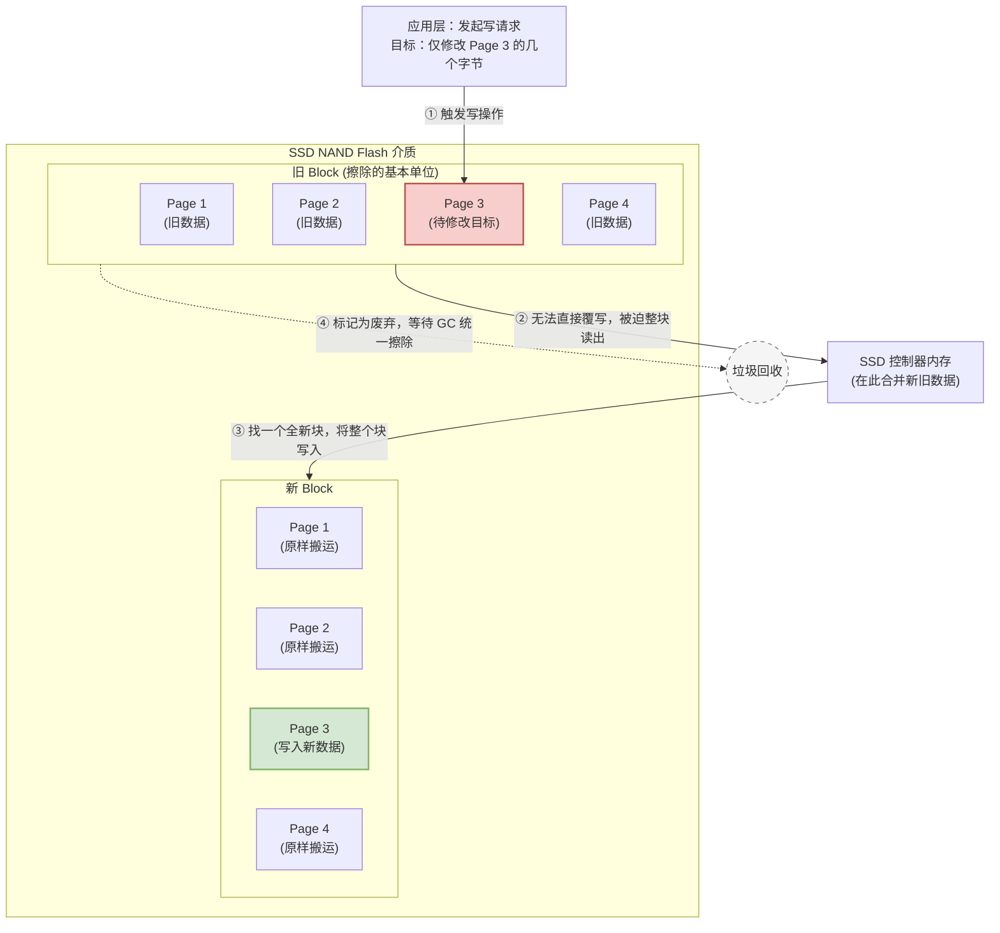
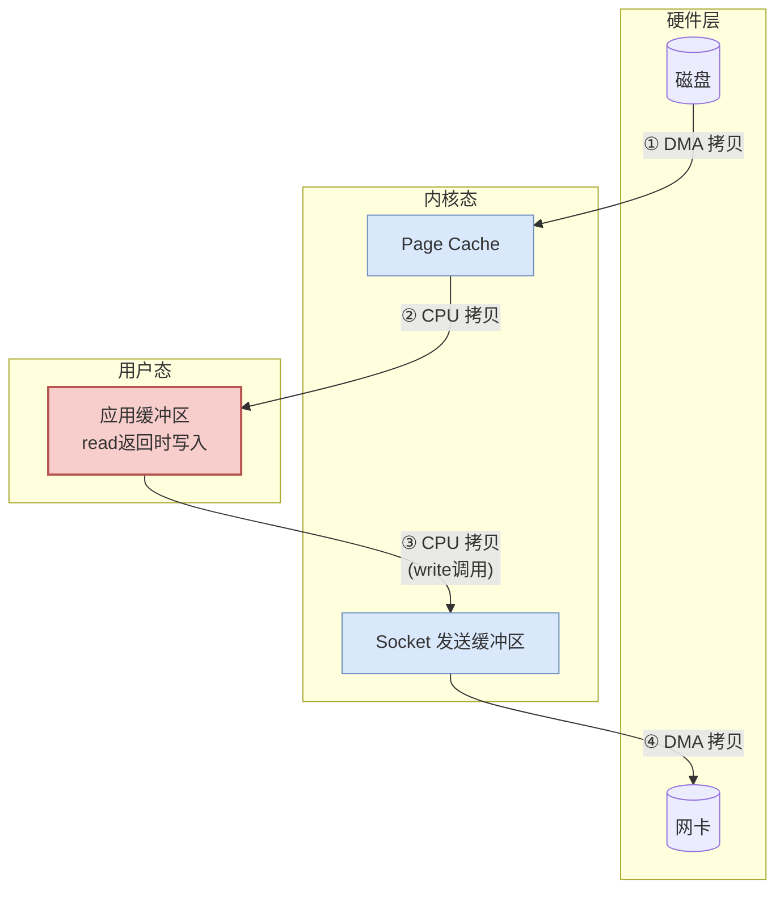
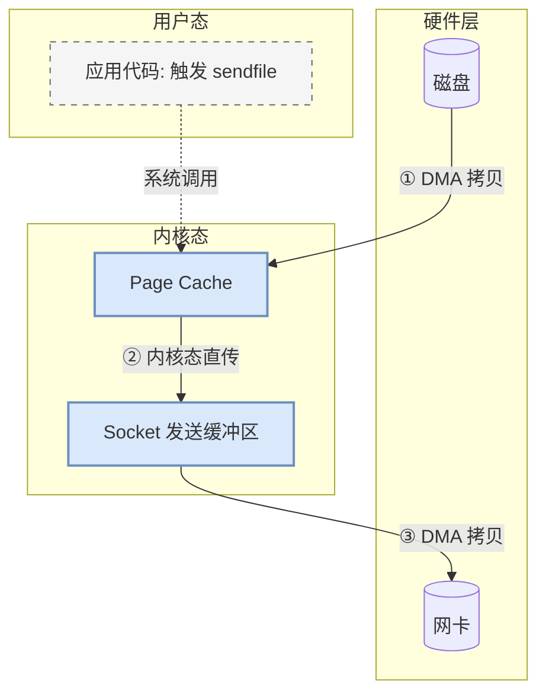
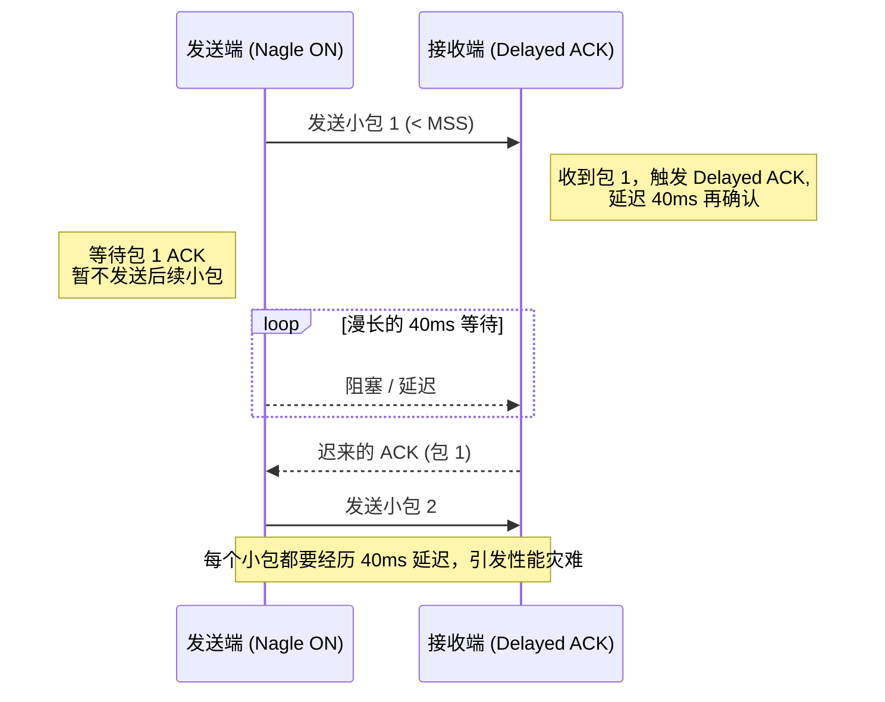
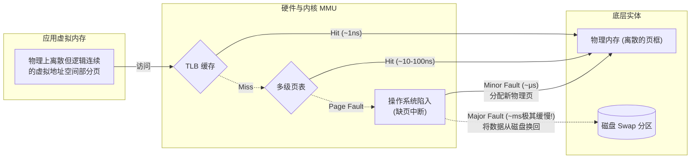
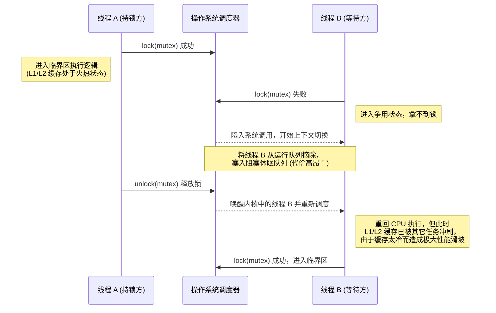
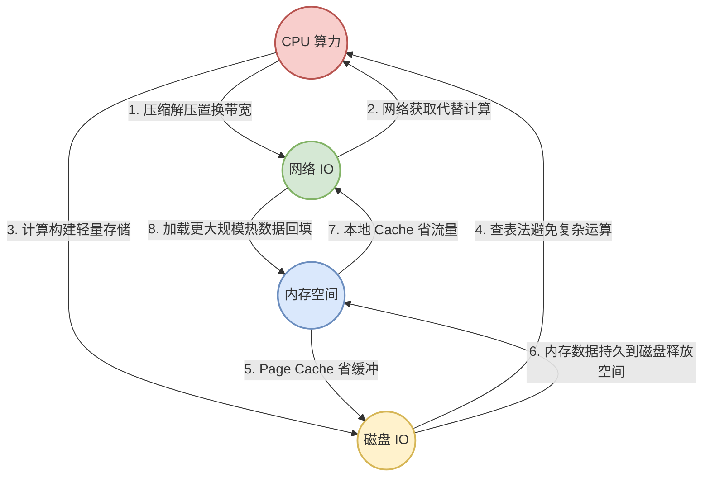

# 软件性能之 `IO`

在《软件性能之 `CPU`》中，我们从多核、缓存、分支预测等硬件特性出发，探讨了如何榨干 `CPU` 的计算时钟周期。现实中的软件系统往往充斥着无数次数据的流转：从磁盘读取文件，通过网络发送数据包，在内存中腾挪结构体，甚至多个线程之间抢夺一把互斥锁。

如果说 `CPU` 的执行速度是一列极速狂飙的高铁，那么主存的访问速度大概是骑自行车，至于磁盘和网络，则彻底沦为了缓慢的步行。性能优化的核心矛盾之一，正是如何让极速的高铁不去停滞等待步行的行人。

| 硬件层级 | 典型延迟 | 类比 |
| :--- | :--- | :--- |
| **`CPU` 寄存器** | `< 1ns` | 伸手拿桌上的笔 |
| **L1 Cache** | `1-3ns` | 走到书架取书 |
| **L2 Cache** | `~10ns` | 去隔壁房间找资料 |
| **L3 Cache** | `30-50ns` | 下楼去物业取快递 |
| **主存 DRAM** | `~100ns` | 骑车去附近图书馆 |
| **`SSD` 随机读** | `~100μs` | 开车去市区办事 |
| **`HDD` 随机读** | `~10ms` | 坐火车去另一个城市 |
| **网络往返** | `~1ms-100ms` | 寄快递到另一个省 |

在软件工程师的视角中，我们对 `IO`（Input/Output）的定义应该更为广义：任何会导致 `CPU` 执行停等、主动让出时间片、进行数据交接的操作，都可以泛称为 `IO` 瓶颈。这不仅包括狭义上的读写磁盘和网络收发，还包括内存的缺页中断，甚至是因为排队等锁而造成的线程挂起。

追求极致的 `IO` 性能，其核心依然是我们一直在强调的那个理念：探寻底层存储、通讯硬件及操作系统的物理规律，并设计精巧的软件去顺应和利用这些规律。

### 磁盘 `IO`：顺应存储介质的物理天性

不论是古老的机械硬盘（`HDD`）还是现代的固态硬盘（`SSD`），它们都是持久化存储的基石。物理规律不可逾越，这决定了它们天然的性能短板。

**`HDD` 机械硬盘的物理掣肘**：`HDD` 的核心结构是永不停歇旋转的磁盘片和来回移动寻找磁道的磁头。这种纯粹的物理机械运动（寻道时间加上旋转延迟），决定了它极其糟糕的随机寻址能力。一次随机读取可能高达 10 毫秒（这在 `CPU` 看来是一万年），而顺序读取只需要磁头保持不动，等待盘片旋转过去即可。

**`SSD` 固态硬盘的写入放大**：现在已经是 `SSD` 的时代，机械结构被淘汰了，是不是就可以随意进行随机读写了？并非如此。`SSD` 的底层存储介质是 NAND Flash，这种介质有一个极其要命的特性：按页（`Page`）读写，按块（`Block`）擦除。也就是说，`SSD` 在写入一块旧地址的数据前，必须先进行擦除（`Erase`）操作。更要命的是，擦除的最小单位是块，通常包含几十上百个页。这就导致了一个可怕的现象——写入放大（`Write Amplification`）。当你试图随机修改某几个字节，`SSD` 控制器可能被迫要把整个块的数据读出来，修改后，再找一个新块全部写回去，最后把旧块标记为废弃等待垃圾回收（`GC`）。这种随机写不仅性能极速衰退，还会急剧消耗 `SSD` 的寿命。

面对这些天性，我们在软件架构层面该如何应对？

**1. 极致推崇顺序写（Append-Only）**

在 `SSD` 大行其道的今天，主流的高性能基础组件依然固执且聪明地坚持着追加顺序写。鼎鼎大名的消息队列 `Kafka`、以 `RocksDB` 和 `LevelDB` 为代表的各类基于 `LSM-Tree` 架构的数据库，其底层存储模型的灵魂都在于将"随机写"转化为"顺序写"。在它们看来，所有的更新和删除操作都是一条新增加的"墓碑"日志。物理层面上，无休止的顺序追加写最大程度迎合了硬盘底层的块分布规律，完美规避了写入放大，在提供极其恐怖的吞吐量的同时，也延长了 `SSD` 的寿命。

**2. 利用 `Page Cache` 与 `mmap` 吸纳磁盘延迟**

因为磁盘确实太慢了，操作系统体贴地在内存里开辟了一层 `Page Cache`（页缓存）。对于大部分应用层软件，如果你不是在写极其底层的系统，与其吭哧吭哧一次次调用 write 去同步刷盘，不如拥抱操作系统的善意。一方面可以通过缓冲（Buffer），将多次细碎的写入在内存里聚合成大块再往下刷；另一方面可以利用 `mmap` 系统调用，将磁盘文件直接映射进应用程序的虚拟内存地址空间。代码里就像操作普通内存数组一样去读写，剩下的时机调度、脏页回写全部交给操作系统的 `pdflush` 守护进程去兜底。

**3. `Direct IO` 还是 `Buffer IO`？**

凡事皆有例外，如果你是在编写一个核心数据库引擎（比如 MySQL 的 `InnoDB`），你可能既不相信操作系统的缓存淘汰调度策略，又不想忍受数据在系统的 `Page Cache` 和应用程序的用户态之间多拷贝一次的双重缓存灾难。这时候，你需要极其霸气地使用 `Direct IO`（直接 `IO`）功能，果断绕过操作系统的所有文件缓存，直接和裸磁盘对话。当然，代价是你必须在自己的应用进程内部，手工实现更为精密和复杂的 `Buffer Pool` 内存池来管理数据的冷热置换。

### 网络 `IO`：从"拷贝"到"零拷贝"的大突围

网络 `IO` 也许是现代分布式系统中被讨论最多的话题。网络流量的收发，绝不仅仅是一根网线把光电信号传输出去那么简单。它的背后纠缠着网卡 `DMA`（直接内存访问）、内核态 `TCP/IP` 协议栈以及用户态缓冲区之间反复的上下文切换与数据拷贝。这些不仅是通讯的鸿沟，更是对 `CPU` 资源的白白浪费。

面对这头横挡在分布式系统面前的巨兽，软件架构上演化出了诸多利器：

**1. 无处不在的多路复用（`IO` Multiplexing）**

关于如何打破老旧模型中"一个连接阻塞一个线程"的魔咒，之前我在《深入剖析网络 `IO` 复用》一文中已经有过极其详尽的探讨，这里只做提纲挈领。核心思想依然是控制 `CPU` 的利用率：既然网络数据的到来时间不可预期，那我们就绝不能让宝贵的线程由于调用了阻塞的 `recv` 或 `accept` 在一个 `Socket` 上傻傻期盼。取而代之的是，借助 `epoll`（Linux）或 `kqueue`（macOS）这样的事件驱动调度机制，让一个个只挂载状态机不占线程栈的事件去等待。只有当真实的读写事件 Ready 时，才去唤醒处理线程。基于这种 `Reactor` 模式，极少数的核心工作线程就可以从容调度和响应数以十万计的并发连接，这也是 `Nginx` 和 `Redis` 能够纵横江湖的核心所在。

**2. 突破壁垒的零拷贝（Zero-Copy）**

我们经常会遇到这样的场景：将一个静态文件或者一段已经存在于磁盘的数据，通过网络发送给客户端。在最原始的实现中，经历了四个惨烈的步骤：

> **痛点**：对于纯搬运场景，`CPU` 做了两次毫无意义的搬运（②和③），数据未做任何修改，并伴随着代价高昂的 4 次系统调用上下文切换。

看出了问题吗？对于一个纯粹的数据搬运工而言，哪怕一丁点儿数据都没有被修改，依然让 `CPU` 做了两次毫无意义的搬运，并且伴随着代价高昂的系统调用上下文切换。

零拷贝（Zero-Copy）技术便是为了斩断这种无谓的消耗。通过调用 `sendfile` 系统调用，应用程序可以直接命令操作系统："请把那个文件描述符里的数据，直接塞进那个 `Socket` 描述符里"。此时，数据从磁盘 `DMA` 跃入 `Page Cache` 后，直接在内核态里经过极其轻量级的封包处理，被直接导向网卡。`CPU` 从繁重的拷贝劳作中被彻底释放，用户态和内核态之间的鸿沟被抹平，网络吞吐量因此得以成倍的飙升。

> **优势**：数据始终不离开内核态，`CPU` 不再参与任何拷贝，直接从 4 次上下文切换降至 2 次。

**3. 网络的组装协议与小包博弈**

网络通信如同物流发货，每一次发车都有固定的物流成本。如果你发出了一万个包裹，但每个包裹里面只装了一颗纽扣，那么包材（`TCP` 头、`IP` 头、以太网帧头）、打包和拆包的开销、网卡的中断处理，将会远远超过这颗纽扣本身的价值。

这引出了网络性能上的经典博弈：`TCP` 的 `Nagle` 算法与 `Delayed ACK`（延迟确认）冲突。为了避免小包泛滥冲垮网络，`Nagle` 算法会强制将多个极小的数据包在发送端积攒成一个大包（达到 `MSS` 大小或者上一个包被确认）再发送。而接收端的 `Delayed ACK` 为了减少回包数量，会有意延迟 40ms 才发送确认包。当这二者不期而遇时，就会引发诡异的"40ms 网络延迟等待血案"。

在追求极低延迟的 `RPC` 框架或实时游戏中，我们通常会第一时间关闭 `Nagle` 算法（设置 TCP_NODELAY）。但这并不是鼓励你去发小包，正确的高级做法是将这种批量管理的权力收归应用层：根据业务的特点，精准挑选紧凑的序列化协议（比如 `Protobuf` 而不是冗长的 `JSON`），并且在应用代码中精心调配数据的组包聚合策略。

### 内存 `IO`：跨越虚拟与现实的桥梁

在上一篇《软件性能之 `CPU`》中，我们从微观视角详细拆解了 `L1/L2 Cache` 和"缓存行（`Cache Line`）"。但如果跳出 `CPU` 核心的包围圈，站在操作系统和物理主板总线的宏观角度去审视内存，这里同样处处是深渊。

操作系统使用了一套极其复杂的黑魔法——虚拟内存布局，通过页表（`Page` Table）和硬件 `TLB`（Translation Lookaside Buffer）将虚拟地址骗过应用程序，最终映射到物理内存上。然而，这种障眼法并非没有代价。

**1. 拥抱连续性与强大的内存对齐（Memory Alignment）**

在 `C/C++` 这类能操控底层内存的语言中，内存对齐一直是个常驻词汇。这不光是为了避免"跨缓存行的伪共享"，更是为了顺应硬件总线的天性。现代 `CPU` 的前端总线读取物理内存时，往往是以字长（比如 64 位系统一次读取 8 字节）为对齐边界进行整块抓取。如果你将一个 4 字节的整数恰好分配在了一个边界横跨了两个读取块的内存地址上，硬件为了取到这个整数，将不得不发起两次完整的总线访存事务，读出两块数据后，再经过极其复杂的位移和拼接才能还原出你想要的值。

这在底层不仅是时钟周期的挥霍，还会消耗总线带宽。这也正是为什么几乎所有的编译器哪怕浪费结构体内部的几字节空间进行无意义的 `Padding` 填充，也要强迫将字段放置在符合硬件直觉的对齐边界上。顺应硬件的对齐规则，它才能投桃报李地跑出最高速。

**2. 致命的缺页中断（`Page Fault`）与 `Swap` 深渊**

当我们使用 `malloc` 等系统调用向操作系统申请内存时，内核起初是非常吝啬的，它只是在程序的虚拟地址空间里画了一张空头支票。只有当你真正伸手去读写这块内存时，硬件 `MMU` 发现没有对应的物理页框，才会引发缺页中断（`Page Fault`），陷入内核去真正分配物理内存并构建页表映射。

如果是由于系统物理内存枯竭，导致操作系统无情地将这块曾属于你的物理内存"置换（`Swap`）"到了磁盘的 `Swap` 分区上。当下一次你再去访问时，触发的便是臭名昭著的 `Major `Page` Fault`。操作系统的处理方式是从龟速的磁盘中将其慢慢悠悠地重新读回内存。在这个漫长的折磨期内，原本期待享受光速访问内存的程序瞬间被按下了静止键。

在极端追求性能的服务端（例如 Elasticsearch、`Redis` 等重度依赖内存的组件），我们甚至会要求直接关闭操作系统的 `Swap` 功能，或者在代码层面调用 `mlock` 系统调用将这部分内存死死地锚定在物理空间中，宁可 `OOM` 崩溃，也绝不忍受 `Swap` 带来的雪崩级别的性能降级。

**3. 大页内存（`Huge Pages`）与对象池分配器**

在大数据集群或者高性能网络转发层，我们还会用上一个更加暴力的手段：大页内存（`Huge Pages`）。Linux 默认的内存分页大小只有 4KB，如果你的应用独占了上百 GB 的内存，那么页表的条目数将是天文数字，极其昂贵的 `CPU` `TLB` 硬件缓存会彻底爆满，频繁发生 `TLB Miss`，导致 `CPU` 必须进行缓慢的多级页表步行遍历。通过开启 2MB 甚至是 1GB 大小的 `Huge Pages`，`TLB` 能够覆盖的内存范围扩张数百倍，大幅消除页表寻址的开销。

此外，高频的内存零碎申请和释放不可避免地会导致系统调用开销的深渊，并伴随内存在宏观上的碎片化。引入类似 `TCMalloc`、`JEMalloc` 这样的高性能现代内存分配器，在线程本地（`Thread-Local`）缓存管理不同尺度的 `Slab` 内存块，或者直接在业务层建立预分配的内存对象池，彻底隔绝与内核分配机制的频繁交互，是进阶优化的必修课。

### 同步与锁：软件逻辑上的"虚拟 `IO` 灾难"

很多人可能并不认为"锁"算是一种 `IO`。但是，如果我们把视野放大，站在操作系统内核调度器的上帝视角里去审视：一个线程想要读写某个变量，却由于另一线程迟迟没有释放互斥锁（`Mutex`）而失败。这时候，内核会毫不留情地将这名不幸的等待者从 `CPU` 运行队列上摘下来，塞进锁的阻塞等待队列休眠，然后强行进行一次极其深度的上下文切换（`Context Switch`）。

这种停顿，与等待一次外部的磁盘文件读取或者等待网络另一端传回的 `TCP` 数据包，在本质的调度消耗上，没有任何区别。甚至更为惨烈的是，当线程最终被唤醒复归时，它所对应的 L1/L2 缓存往往早已经被其他工作负载给冲刷殆尽了。我们可以将由于锁造成的阻塞，定义为一种在软件代码逻辑上人为制造出来的 **"虚拟 `IO` 事故"**。

**1. 降低锁冲突的物理防线**

性能优化里有一句至理名言：锁的开销不在于加锁本身，而在于争用（Contention）。缓解这个问题的初级手段是拆分冲突域，减小临界区。比如在数据库中将粗暴的表级锁降级为精确的行级锁；在内存数据结构中将全局的大锁劈开，演化出具备代表性的分段锁机制（例如经典时代 Java 中的 ConcurrentHashMap，通过分段 Segments 让原本挤在一座独木桥上的线程分散到几十座桥上同时过河）。

**2. 极致的退避与无锁架构（Lock-Free）**

当我们对性能的渴望到了锱铢必较的地步，传统的基于操作系统内核仲裁的互斥锁就显得太过笨重了。与其排队休眠交出调度权，不如利用现代 `CPU` 底层直接提供的原子指令——例如基于硬件总线锁或缓存锁机制的 `CAS`（Compare-And-`Swap`，比如 x86 下的 lock cmpxchg 指令），在用户态直接构建高阶的无锁数据结构。大名鼎鼎的 LMAX Disruptor 高性能并发框架，正是依靠基于无锁 `RingBuffer` 以及精巧的序号协调机制，轻松在单机上跑出了惊天动地的吞吐量。

**3. 化整为零：不共享即是不冲突**

无锁（Lock-Free）甚至无等待（Wait-Free）确实精妙到了极点，但编码的心智负担极高，稍有不慎就是死循环或者是极其隐蔽的并发 Bug。

最顶级的防守，往往是彻底消灭进击的冲动：最好的锁就是没有锁。比起复杂的加锁姿势，我们更应该从系统架构的根源上去思考：能不能通过巧妙的任务状态切分，让每个处理单元各自盘踞一方？

例如，利用局部化的 ThreadLocal 变量为每个线程独自分配独立的资源副本，在线程终结前再去进行汇总（极其类似 MapReduce 的单机版实践）。又或者，彻底转向单线程的 `Event Loop` 事件循环模型（像早期的 `Redis`、`Node.js` 这样，依靠极其纯情的单线程串行处理在内存中的所有数据结构，用超高的执行速度碾压由于并发锁带来的复杂消耗）。让线程只处理自己的事情，没有共享变量，就没有资源竞争，这才是根治"虚拟 `IO`"问题的最终解药。

### 总结：系统观下的平衡艺术

性能优化的世界没有银弹，它永远充斥着此消彼长和惊险的走钢丝。在这个体系中，`CPU` 算力与各种 `IO` 瓶颈在很多场景下是典型的资源置换关系。

**核心法则**：用充裕而廉价的长板资源，填补最短那块短板的性能黑洞。

我们要减少极其缓慢的网络 `IO` 耗时和带宽挤占，就不惜在两端额外消耗昂贵的 `CPU` 去对数据进行高强度的 Gzip 或者 Snappy 压缩（用 `CPU` 算力置换网络流量）；我们要降低对于 `CPU` 重复计算的依赖，同时规避更底层的深渊磁盘读取，就不惜在内存中挥金如土般地开辟巨大的缓存层（用内存空间去置换 `CPU` 与磁盘的等待时延）。

好的架构与系统设计，绝不等于对着单一的代码模块疯狂地调参数飙单车。它要求工程师必须在 `CPU`、内存、磁盘和网络这个宏大的四维空间里，建立起极具前瞻性的全局系统观。彻底洞察并敬畏底层软硬件的物理特性与其不可逾越的鸿沟，用充裕而廉价的长板资源去填补木桶中最短的那块短板带来的性能黑洞，这就是高性能软件设计的至高平衡艺术。

Finally, 高性能软件架构这条路充满荆棘却魅力无穷。从《`CPU` 篇》里贴近硅芯片的毫秒级严密算计，再到横跨《`IO` 篇》的操作系统调度、总线访问机制以及物理介质的特性，那些看似枯燥的理论，是通往高性能软件的必须要跨过的障碍。